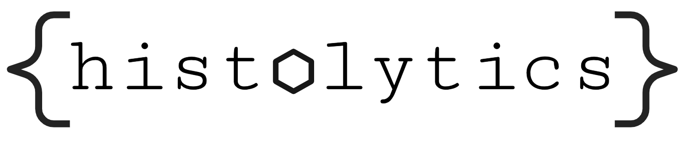

<div align="center">



**Python library for 2D panoptic segmentation segmentation of histologic WSIs and their scalable spatial analysis**

[](https://github.com/okunator/cellseg_models.pytorch/actions/workflows/tests.yml) [](https://github.com/okunator/cellseg_gsontools/blob/master/LICENSE) [](https://www.python.org/)

</div>

## Introduction

**histolytics** is a spatial analysis library for histological whole slide images (WSI) library built upon [`torch`](https://pytorch.org/), [`geopandas`](https://geopandas.org/en/stable/index.html) and [`libpysal`](https://pysal.org/libpysal/). The library contains multi-task encoder-decoder architectures for **panoptic segmentation** of WSIs into [`__geo_interface__`](https://gist.github.com/sgillies/2217756)-format and a wide array of spatial analysis tools for the resulting segmentation masks.

## Installation 🛠️

```shell
pip install histolytics
```

## Models 🤖


- Panoptic [HoVer-Net](https://www.sciencedirect.com/science/article/abs/)
- Panoptic [Cellpose](https://www.nature.com/articles/s41592-020-01018-x)
- Panoptic [Stardist](https://arxiv.org/abs/1806.03535)
- Panoptic [CellVit-SAM](https://arxiv.org/abs/2306.15350)
- Panoptic [CPP-Net](https://arxiv.org/abs/2102.06867)
