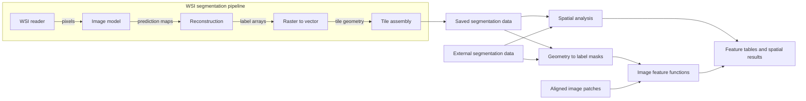

# Dependency architecture proposal

Status: proposed, 10 October 2026. This document describes a target and migration
gates; implemented API changes are recorded in the changelog. PR 8 made existing
requirements explicit as a separate declaration change. Installation groups remain
proposed.

## Modules first, installation groups second

The primary goal is independently usable capabilities, not just a shorter dependency
list. WSI reading, image inference, prediction reconstruction, vector conversion,
tile assembly, feature computation, and spatial analysis should each operate on
explicit data. Pipeline code chooses and combines them into a complete workflow.

A capability must not require an instance, execution state, or hidden import from
an unrelated capability. It may use its own numerical engine and small shared
stateless primitives. Common primitives must not import the capabilities that use
them. Existing folder boundaries are not automatically the right capability
boundaries; preserve useful internal reuse rather than duplicating algorithms to
make every file isolated.

Standalone means that a capability can be called with suitable data from another
producer, including a different tool. It does not require a separate repository,
distribution, plugin system, or an extra for every module. Derive installation
groups from the actual dependency closures after establishing the code boundaries.

## Capability responsibilities

| Capability | Accepts | Returns | Should not own |
| --- | --- | --- | --- |
| Slide reading | A slide path, selected backend, pyramid level, and region coordinates | Image arrays and slide/tile metadata | Models, reconstruction, feature callbacks, Torch batch scheduling |
| Image inference | An image/batch, model configuration or checkpoint, and explicit preprocessing/device settings | Existing prediction maps/output objects | Slide paths, tile enumeration, slide-wide merging, result-file naming |
| Prediction reconstruction | Prediction maps, the reconstruction algorithm/settings, and class mapping | Instance/type/semantic label arrays | A model instance, slide reader, prior inference state, output directories |
| Raster/vector conversion | Label arrays or geometry, dimensions, coordinate offsets, class mapping | GeoDataFrames or raster masks using existing representations | Model architecture, checkpoint loading, slide opening, file writing |
| Tile assembly | Tile segmentations, their placement/overlap metadata, precision and merge settings | Slide-level instance/tissue geometry | Re-running prediction or requiring a segmenter's processed flag |
| Image features | Image arrays, instance labels, optional masks and feature settings | pandas feature tables indexed by stable object IDs | Model classes, slide paths, automatic segmentation |
| Spatial operations and analysis | Geometry, values, neighbor/weight data, and explicit units/settings | Selected geometry, graphs/weights, aggregates, clusters, or feature tables | Image inference, WSI backends, model-generated-only data |
| Result I/O | Existing arrays/tables/geometry and a requested path/format | Saved artifacts or loaded data | Computing missing predictions or features as a side effect |
| Pipelines | The selected capabilities and workflow inputs/settings | A composed WSI segmentation or analysis result | Reimplementing the numerical algorithms inside orchestration |

Keep the current NumPy, Torch, pandas, GeoPandas, and libpysal representations.
Use the existing upstream output dataclasses at the engine boundary while useful;
do not introduce a universal result object or conversion wrappers for every stage.
High-level convenience APIs can remain composition facades so existing callers
do not need an immediate rewrite. Their responsibilities must be distinguished
from the independently callable computation they compose.

## Handoff contracts

- **Reader to inference:** RGB image axis order, dtype/range, preprocessing, batch
  order, tile origin, level/downsample, and calibration must be explicit. The
  pipeline performs necessary layout/device conversion once and keeps metadata
  aligned with each sample; an image model does not need a concrete SlideReader.
- **Inference to reconstruction:** preserve actual `nuc`, optional `cyto`, and
  `tissue` output keys and the existing type/auxiliary/binary fields. Document raw
  forward output separately from predictor output: the current predictor applies
  argmax to class maps, so a class named SoftInstanceOutput is not proof that every
  field contains probabilities. Test named axes, logits/probabilities/classes,
  device, and algorithm-specific auxiliary maps before extracting this interface.
- **Reconstruction to conversion/assembly:** use the existing label arrays, with
  background conventions, class IDs, and instance IDs preserved. Record whether
  IDs are tile-local or slide-wide; pipelines/assembly establish uniqueness.
- **Coordinates:** keep pixel coordinates, tile origin, level/downsample, and
  physical calibration separate. Apply scale/offset exactly once. Validate the
  current backend conventions before standardizing the contract; a CRS field alone
  does not establish physical units for histology pixels.
- **Segmentation to analysis:** use stable IDs, geometry/class columns, and the
  required coordinate metadata in GeoDataFrames/Parquet, or image/label arrays
  where image features need pixels. Analysis should work on externally generated
  masks/geometry and previously saved results without importing the producer.
- **Graph to aggregation:** accept existing neighbor mappings/weights and object
  values, rather than requiring that Histolytics constructed the graph. Share a
  small stateless indexing/distance primitive when needed; do not make aggregation
  depend on the whole graph-construction capability.

Store only metadata needed to reproduce the result and interpret its coordinates;
reuse current columns, dictionaries, and artifact formats first. Introduce a new
schema or type only for a demonstrated gap, including its reader/writer tests.

## Two compositions

WSI segmentation composes reading, image inference, reconstruction, raster/vector
conversion, tile assembly, and result writing. It streams bounded batches; it
does not gather every slide prediction merely to merge or write the outputs.

Downstream analysis starts from segmentation data. Geometry-only analysis needs
no slide access. Image-based nuclear/stromal analysis additionally obtains aligned
image patches and label masks, then calls feature functions. It can run later in
a different process or environment without retaining the model or segmenter.

The arrows describe data passed by orchestration, not module imports. The pipeline
also carries tile placement and calibration through reconstruction/conversion to
assembly; those metadata are not discarded at the image-model step.

## Current seams to improve

- Raster/vector conversion and spatial selection already accept externally
  generated segmentation arrays and saved GeoDataFrames. Exercise their composition
  with model/GPU packages blocked, preserving sparse IDs, class names, pixel offsets,
  and geometry. Keep basic geometry queries in shared utilities so analysis and tile
  assembly use one implementation without depending on each other.
- `WsiPanopticSegmenter.segment` currently owns reading/batching, layout/device
  conversion, prediction, reconstruction, class mapping, and output filenames.
  Keep it as the public composition entry point while making the called operations
  independently usable. Do not replace it with a generic workflow scheduler.
- `BaseModelPanoptic.post_process` requires inference mode and also accepts save
  paths, coordinates, smoothing, and class dictionaries. Reconstruction on supplied
  predictions must eventually be callable without an initialized model. Reuse the
  upstream processor; first test actual in-memory returns and save-mode behavior
  before moving any existing convenience method or changing outputs.
- `WSIPatchIterator` and `WSIPatchDataset` combine readers, spatial queries,
  rasterization, Torch loading, and callbacks. That is workflow composition, not
  the minimal reader. Preserve those APIs as adapters and keep a direct region-read
  path usable independently. A new callback/protocol framework is not needed.
- The merger classes already accept geometry and coordinates and can return
  geometry with `dst=None`. Reuse this seam for standalone assembly. The high-level
  segmenter's `_has_processed` guard must not prevent processing existing tile data
  through the standalone merger; do not remove its current guard without a caller
  compatibility test.
- Spatial aggregation/clustering currently import peer graph/geometry helpers.
  Trace each helper before changing its owner. A one-line Shapely distance call or
  a genuinely shared primitive may be sufficient; a file-moving sweep is not the
  goal. Keep substantial domain computation with the capability that owns it.

## Recommended default

Make plain `pip install histolytics` provide spatial analysis, CPU nuclei/stroma
features, plotting, raster/vector conversion, and bundled example data. Users who
already have segmentations should not need model frameworks or a NVIDIA runtime.
Keep panoptic segmentation as a first-class optional capability with documented
installation commands. Keep cuCIM and PyTorch CUDA support.

This default is a recommendation pending the maintainer's preference. A more
conservative first release can keep CPU segmentation in the default and make
only NVIDIA processing/backends optional. The same import-boundary work below
is needed before a later spatial-only default can work reliably.

## Feature groups

Names are provisional; implement only groups with working imports and installation
tests. Avoid an extra for every small dependency or a generic plugin framework.

| Installation | Capability | Dependency ownership |
| --- | --- | --- |
| Base | Spatial queries/graphs/clustering, CPU nuclei/stroma features, plotting, bundled images/Parquet data, raster conversion | NumPy, pandas, SciPy, scikit-image, GeoPandas, Shapely, PyProj, PyArrow, rasterio, libpysal, esda, mapclassify, NetworkX, h3, quadbin, pandarallel, psutil, Matplotlib, OpenCV. Retain dependencies genuinely needed by these implementations. |
| `segmentation` | Panoptic models, checkpoints, inference composition, losses and metrics | cellseg-models-pytorch, Torch, torchdata where the batch adapter uses it, Hugging Face Hub, safetensors, Pillow, and common WSI dependencies only where requested. Patch-image inference does not require OpenSlide. Declare and test the selected reader separately; preserve its existing default and missing-backend behavior. Albumentations currently remains coupled through published upstream inference imports. |
| `cucim` | Retained cuCIM slide-reader backend | cuCIM plus common WSI dependencies. The current cuCIM distribution itself requires CuPy. This extra must include its common WSI dependency closure, or the documented installation must explicitly compose it with `segmentation`; a backend-only install must not promise an unusable SlideReader. |
| `cuda-analysis` | Existing CuPy/cupyx feature kernels and cuML image clustering | cupy-cuda12x, cuML, cuCIM. Keep this separate from Torch CUDA model execution and evaluate the processing implementations before removal. |
| `training` | Augmentations, HDF5 datasets, and the documented finetuning workflow | Segmentation requirements, Albumentations, PyTables, and the Hugging Face datasets package used by the finetuning notebook. The published FileHandler and Histolytics DatasetH5 both use PyTables; do not add h5py without an actual consumer. |
| `polars` | Opt-in Polars conversion/graph paths | Polars. Existing conversion functions already import it lazily. |
| `bioio` | Optional BioIO reader backend | Common WSI requirements, BioIO, and explicitly tested reader plugins for the supported formats. Installing BioIO alone does not establish that every advertised format has a working reader. |

Plotting stays in the base initially because it is a normal spatial-analysis
workflow. OpenCV remains there while contour plotting and sample-image decoding
use it; choosing a GUI versus headless OpenCV distribution needs a separate
compatibility check against upstream requirements. Do not install competing CuPy
distributions: use the CUDA-specific provider consistent with the cuCIM/cuML stack.

Target commands would be `histolytics`, `histolytics[segmentation]`, and, for
cuCIM WSI inference, `histolytics[segmentation,cucim]`. These are illustrative
future commands, not extras available in the current release. Training and backend
groups must include or clearly compose their shared prerequisites. A single
cross-platform `all` extra is not proposed: Linux NVIDIA backends have different
requirements from a CPU analysis installation.

## Verified import constraints

The following were checked against Histolytics and the published
cellseg-models-pytorch 0.1.30, rather than assuming changes in its local maintenance
checkout are already released:

1. **Common utilities load the model stack.** `histolytics.utils.__init__` eagerly
   imports FileHandler/H5Handler from cellseg utilities. That upstream initializer
   imports tensor utilities, which import Torch, and mask utilities using Numba.
   Importing `histolytics.utils.gdf` without cellseg currently fails in the parent
   initializer before the spatial helper can load. Remove these upstream aliases
   from the shared utility initializer and import the classes directly from
   `cellseg_models_pytorch.utils` in segmentation examples. Document the import-path
   migration; do not add dynamic compatibility hooks or copy the upstream manager.
2. **Bundled samples cross the same boundary.** data.fetch imports FileHandler at
   module load and uses it for two JPEG reads. Those reads are OpenCV imread plus
   BGR-to-RGB conversion. Use the existing codec directly in the sample loader,
   preserving pixel values, dtype, shape, color order, and attribution. Test both
   bundled images against the current loader before changing the implementation.
   A casual switch to a different decoder is not an identical-output guarantee.
3. **Inference and augmentation imports are intertwined.** Histolytics' WSI
   segmenter imports the upstream dataset package. The published initializer
   imports training datasets and Albumentations transforms eagerly. Removing
   Albumentations from inference metadata alone would break imports. Consume a
   tested upstream release with the boundary fixed before separating training
   requirements; do not hide that failure or use an unpublished checkout in a release.
4. **WSI adapters currently live upstream.** SlideReader imports OpenSlide,
   cuCIM, and BioIO adapters from cellseg. This is not currently a Torch-free WSI
   installation. The published readers already guard missing dependencies at
   construction; retain that mechanism unless a failing contract test establishes
   a need to change it. Keep reader support with the model/WSI group until upstream packaging
   provides a genuinely independent reader boundary; do not duplicate reader implementations.
5. **CPU processing and CUDA processing need independent availability checks.**
   Intensity/chromatin annotations are now deferred, and texture imports are guarded.
   Image utilities still overwrite one shared availability flag in separate CuPy/cuML
   and cuCIM import blocks. Test each optional stack independently before moving it
   out of the default requirements. Preserve documented errors and resolve silent
   fallback policy explicitly when changing public behavior.
6. **The datasets package is an example/training dependency.** No source module
   imports Hugging Face datasets; the finetuning notebook does. Move its ownership
   to the appropriate optional workflow instead of treating it as a spatial core need.

Torch CPU execution and installation footprint are different concerns. PyPI Torch
wheels may bring CUDA runtime packages even when inference uses `device="cpu"`.
Document CPU-wheel installation/index choices separately from Histolytics extras;
an extra name cannot select a GPU driver or repair an incompatible CUDA environment.

## Migration sequence

1. **Record the current handoffs and numerical selections.** Capture actual keys,
   axes, values, coordinates, class/instance identity, and in-memory versus save-mode
   behavior at the operations being separated. Moving cellseg out of a base install
   also removes its NumPy/Arrow/rasterio constraints from that install. Preserve or
   deliberately validate those numerical selections before a packaging split; do
   not let fresh base installations silently become a numerical upgrade.
2. **Decouple common imports and sample data first.** Preserve public import paths
   and image values. Add subprocess tests that block Torch, cellseg, CUDA packages,
   training dependencies, and Polars while running representative spatial queries,
   graph/aggregation work, CPU features, plotting imports, and sample loaders.
3. **Separate NVIDIA installation requirements.** Add/test cuCIM and CUDA-analysis
   selections on Linux, and verify CPU imports without either. Retain cuCIM; this
   metadata separation is not a decision to remove CuPy processing implementations.
4. **Expose existing computation seams as standalone operations.** Start with the
   current mergers and array/geometry helpers; separate prediction reconstruction
   from model lifecycle only after its return contract is verified. Keep high-level
   APIs as composition facades. Add one small end-to-end composition test for each
   changed seam and run the existing relevant regressions. Do not build all proposed
   groups or reorganize every folder in one change.
5. **Separate model and training groups.** Validate CPU models and WSI iteration,
   publish/consume the needed upstream import fixes, and exercise real HDF5 training
   samples rather than just importing the class. Preserve loss/metric/transform APIs.
6. **Change the default only at a documented release boundary.** Moving formerly
   mandatory features to extras changes the installation contract. Update README,
   notebooks, API guides, error messages, CI/release installation checks, and migration
   instructions together. Keep package/module/tag version agreement.
7. **Coordinate numerical upgrades and Python 3.13 separately.** Segmentation still
   inherits Numba/Arrow/NumPy constraints from the published upstream package. A
   universal uv lock can couple base and extra selections. Check the selected
   dependency graph for each install profile and do not promise that extras alone
   solve Python 3.13 compatibility or refresh scientific baselines automatically.

## Acceptance checks

- A model predicts on an image without a slide reader or output directory;
  reconstruction processes saved/supplied predictions without a model instance;
  assembly processes existing tile geometry without first invoking segmentation.
- Analysis consumes saved or external segmentation outputs with model/WSI imports
  blocked. Image features receive aligned pixels/masks directly. Pipelines, rather
  than leaf capabilities, are responsible for coordinating those steps.
- Base wheel/source installs on the intended Linux/macOS CPU matrix without
  importing model, CUDA, training, or optional backend modules. Add Windows only
  after its actual installation and runtime tests pass.
- Base image/raster/geometry and bundled-data results match predefined references;
  checkpoint/prediction validation belongs to the segmentation profile.
- Segmentation performs CPU forward/backward/inference and bounded WSI iteration;
  retained cuCIM reads a pinned small slide fixture on a supported Linux environment.
- Optional training performs HDF5 read/transform/batch steps; Polars conversion
  preserves identifiers and geometry representation; BioIO plugins read the claimed
  formats. Missing groups fail at the requested feature with useful installation guidance.
- CUDA processing compares values, complete-call runtime, transfer overhead, and
  peak memory on a CUDA machine. CPU CI or a successful import is not that validation.
- Built metadata expresses each group correctly, uv/pip profiles resolve as
  documented, and release gates cover the advertised combinations. Report genuine
  unavailable hardware/platform coverage rather than marking it tested.

References: [PyPA optional dependencies](https://packaging.python.org/en/latest/guides/writing-pyproject-toml/),
[cuCIM installation](https://github.com/rapidsai/cucim),
[CuPy package selection](https://docs.cupy.dev/en/stable/install.html), and
[BioIO reader plugins](https://bioio-devs.github.io/bioio/).
