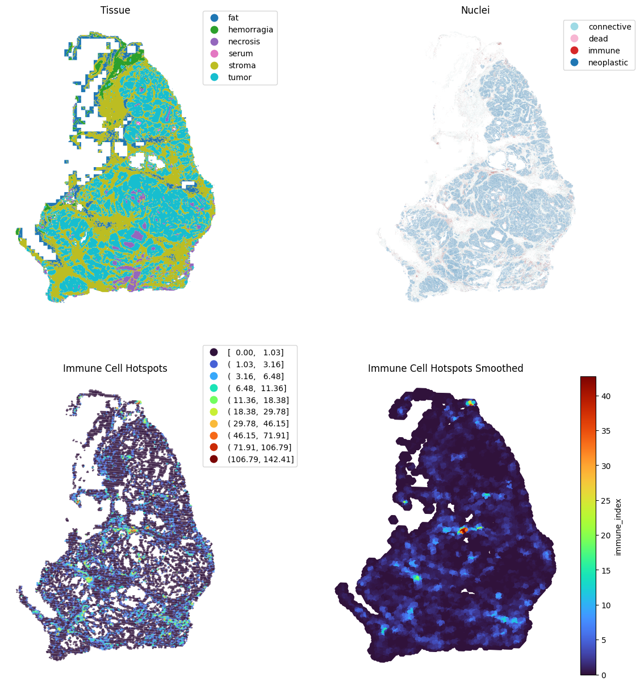

# Histolytics

Welcome to the Histolytics documentation. Histolytics is a Python package for WSI-scale panoptic histopathological image analysis and visualization.

## Getting started with Histolytics

- [Installation Guide](installation.md)
- [Segmentation Quick Start](./user_guide/seg/getting_started_seg.md)
- [API Reference](api/index.md)

## Contributing

We welcome contributions! To get started:

1. Fork the repository and create your branch from `main`.
2. Make your changes with clear commit messages.
3. Ensure all tests pass and add new tests as needed.
4. Submit a pull request describing your changes.

See [contributing guide](https://github.com/HautaniemiLab/histolytics#) for detailed guidelines.
